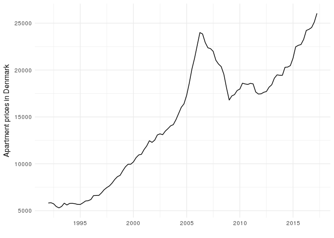

<!-- README.md is generated from README.Rmd. Please edit that file -->
realestateDK
============

The goal of realestateDK is to provide quarterly information on the danish Housing Market. This includes average square meter prices and the number of free trades for parcel and terraced houses, condominiums and holiday homes in Denmark since 1992. Visit <http://finansdanmark.dk/toerre-tal/boligstatistik/boligmarkedsstatistikken/> and <http://rkr.statistikbank.dk/> for more information.

Installation
------------

You can install realestateDK from github with:

``` r
# install.packages("devtools")
devtools::install_github("mikkelkrogsholm/realestateDK")
```

Example
-------

The package has several functions for getting real estate data for Denmark. The data is retrieved from the API of "Boligmarkedsstatistikken", which you can find here: <http://rkr.statistikbank.dk/>.

Basic example
=============

### First load the packages needed

``` r
library(realestateDK); library(dplyr); library(statsDK); library(ggplot2)
```

Lets see what functions are available in the package:

``` r
ls("package:realestateDK")
#>  [1] "BM010"      "BM011"      "BM020"      "BM021"      "BM030"     
#>  [6] "BM031"      "table_vars" "UDB010"     "UDB020"     "UDB030"    
#> [11] "UL10"       "UL30"
```

If we inspect the `BM010()` function then we see that it is a function for retrieving "Property prices in housing market". More specifically it gets property prices in housing market by area, property category, prices of completed transactions and time.

The help information for the function show us the following parameters:

-   **EJKAT20** is the property category. Call realestateDK::table\_vars("BM010") to see all available parameter settings.

-   **OMR20** is the area. Call realestateDK::table\_vars("BM010") to see all available parameter settings.

-   **PRIS20** is the prices of completed transactions. Call realestateDK::table\_vars("BM010") to see all available parameter settings.

-   **Tid** is the time. Call realestateDK::table\_vars("BM010") to see all available parameter settings.

-   **lang** whether to return the data in english or danish.

They state that we can call `table_vars("BM010")` to see all available parameter settings. Lets try that:

``` r
table_vars("BM010")
#> Metadata collected succesfully
#> # A tibble: 223 x 4
#>    param setting                  description  type
#>    <chr>   <chr>                        <chr> <chr>
#>  1 OMR20      00                  All Denmark  area
#>  2 OMR20     084               Capital region  area
#>  3 OMR20      01    Subregion Copenhagen City  area
#>  4 OMR20     101                   Copenhagen  area
#>  5 OMR20     147                Frederiksberg  area
#>  6 OMR20     155                       Dragør  area
#>  7 OMR20     185                       Tårnby  area
#>  8 OMR20      02 Subregion Copenhagen suburbs  area
#>  9 OMR20     165                  Albertslund  area
#> 10 OMR20     151                     Ballerup  area
#> # ... with 213 more rows
```

This produces a table that shows us all the possibilities that we have when we call this function to retrieve property prices in housing market.

You can call the function yourself on the other function names to get the paramenters for them as well.

### Retrieve data

Lets get data for `Owner-occupied flat` in `All Denmark` at the `Transaction price realised` for all available times.

``` r
my_data <- BM010(EJKAT20 = "2", OMR20 = "00", PRIS20 = "REAL", Tid = "*")
#> Getting data. This can take a while, if the data is very large.
#> Data collected succesfully
```

Notice the use of the asterix ("\*"). This tells the API to get all available data for that parameter.

Lets look at the data:

``` r
glimpse(my_data)
#> Observations: 102
#> Variables: 5
#> $ EJKAT20 <chr> "Owner-occupied flat", "Owner-occupied flat", "Owner-o...
#> $ OMR20   <chr> "All Denmark", "All Denmark", "All Denmark", "All Denm...
#> $ PRIS20  <chr> "Transaction price realised", "Transaction price reali...
#> $ TID     <chr> "2009Q4", "2010Q1", "2010Q2", "2010Q3", "2010Q4", "201...
#> $ INDHOLD <int> 17815, 17970, 18593, 18515, 18463, 18577, 18522, 17655...
```

We can see that the time (TID) column is in Quarters. We can change that with help from the `statsDK` package and the `fix_time()` function.

``` r
my_data$TID <- fix_time(my_data$TID)

glimpse(my_data)
#> Observations: 102
#> Variables: 5
#> $ EJKAT20 <chr> "Owner-occupied flat", "Owner-occupied flat", "Owner-o...
#> $ OMR20   <chr> "All Denmark", "All Denmark", "All Denmark", "All Denm...
#> $ PRIS20  <chr> "Transaction price realised", "Transaction price reali...
#> $ TID     <date> 2009-10-01, 2010-01-01, 2010-04-01, 2010-07-01, 2010-...
#> $ INDHOLD <int> 17815, 17970, 18593, 18515, 18463, 18577, 18522, 17655...
```

Now we can plot the data:

### Plot the data

``` r
ggplot(my_data) + 
  geom_line(aes(x = TID, y = INDHOLD)) + 
  labs(x = "", y = "Apartment prices in Denmark") +
  theme_minimal()
```



Wow, what a development. We also see the effect of the financial crisis and the current rebound.

### Meta data

The table with the data also contains the meta data as attribute.

You can access the meta data this way:

``` r
metadata <- attributes(my_data)$metadata

glimpse(metadata)
#> List of 9
#>  $ id           : chr "BM010"
#>  $ text         : chr "Property prices in housing market"
#>  $ description  : chr "Property prices in housing market by area, property category, prices of completed transactions and time"
#>  $ unit         : chr "DKK per m2"
#>  $ updated      : chr "2017-09-15T09:00:00"
#>  $ contact      :List of 3
#>   ..$ name : chr "Finans Danmark"
#>   ..$ phone: chr "+4533124811"
#>   ..$ mail : chr "stat@fida.dk"
#>  $ documentation: NULL
#>  $ footnote     : NULL
#>  $ variables    :'data.frame':   4 obs. of  6 variables:
#>   ..$ id         : chr [1:4] "OMR20" "EJKAT20" "PRIS20" "Tid"
#>   ..$ text       : chr [1:4] "area" "property category" "prices of completed transactions" "time"
#>   ..$ elimination: logi [1:4] TRUE FALSE FALSE FALSE
#>   ..$ time       : logi [1:4] FALSE FALSE FALSE TRUE
#>   ..$ map        : chr [1:4] "denmark_municipality_07" NA NA NA
#>   ..$ values     :List of 4
#>   .. ..$ :'data.frame':  115 obs. of  2 variables:
#>   .. ..$ :'data.frame':  3 obs. of  2 variables:
#>   .. ..$ :'data.frame':  3 obs. of  2 variables:
#>   .. ..$ :'data.frame':  102 obs. of  2 variables:
```
